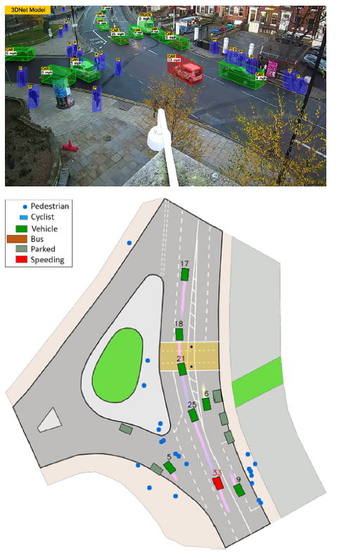

# 3D Traffic Monitoring: Monocular 3D Object Recognition

## Overview
This project focuses on developing a state-of-the-art traffic monitoring system using monocular 3D object recognition techniques. The system leverages deep learning algorithms to accurately detect and monitor various road users, such as vehicles and pedestrians, using a single camera. This approach aims to provide a cost-effective and efficient solution for traffic monitoring in urban environments.

## Project Details
### Objective
The main objectives of this project are:
1. Develop a monocular 3D object detection model for traffic monitoring.
2. Accurately identify and track different types of road users, including vehicles and pedestrians.
3. Enhance traffic monitoring capabilities using cost-effective single-camera setups.
4. Provide real-time traffic analysis to improve urban traffic management and safety.

### Methodology
#### Monocular 3D Object Detection
- **Deep Learning Model**: Utilized a custom 3D object detection model to capture and process 3D information from a single camera.
- **Bounding Box Estimation**: The model estimates 3D bounding boxes around detected objects, providing accurate spatial information.

#### Data Fusion and Validation
- **Data Integration**: Combined 3D data with 2D imagery to enhance object detection accuracy.
- **Validation**: Employed rigorous validation techniques to ensure the robustness and reliability of the detection model.

#### Advanced Tracking and Calibration
- **Object Tracking**: Implemented multi-object and multi-class tracking to follow detected objects over time.
- **Auto-Calibration**: Developed a novel auto-calibration technique to adjust the system for different camera setups and perspectives.

### Features
1. **Monocular 3D Detection**: Capture 3D information using a single camera, reducing costs and complexity.
2. **Real-Time Monitoring**: Provide real-time detection and tracking of various road users.
3. **Traffic Analysis**: Analyze traffic flow, congestion, and safety in urban environments.
4. **Cost-Effective Solution**: Deploy a scalable and affordable traffic monitoring system using existing surveillance infrastructure.

## Example Usage

**Input:** A single camera setup monitoring a busy urban intersection.

**System Output:**
- **3D Object Detection**: The system identifies vehicles and pedestrians in the scene, estimating their 3D positions and orientations.
- **Object Tracking**: Continuously tracks the detected objects, updating their positions in real-time.
- **Traffic Analysis**: Provides insights into traffic flow, congestion levels, and potential safety hazards.

**Scenario Steps:**
1. **Camera Setup**: Install a single camera at the desired monitoring location.
2. **Data Capture**: The camera captures continuous video feeds of the traffic scene.
3. **Model Application**: Apply the 3D object detection model to the video feeds to identify and track road users.
4. **Real-Time Monitoring**: Monitor traffic conditions in real-time, using the system's output to make informed decisions.

### Benefits
- **Enhanced Safety**: Improve traffic safety by providing accurate and real-time monitoring of road users.
- **Efficiency**: Streamline traffic management operations with advanced detection and tracking capabilities.
- **Scalability**: Easily scale the system to cover larger areas or more intersections using cost-effective single-camera setups.

### Running the Model
To use the model:
1. Ensure your environment is set up with the necessary tools (e.g., PyTorch).
2. Load your video feeds into the specified directories.
3. Run the preprocessing script to prepare the data for model input.
4. Execute the object detection model to identify and track road users.
5. Analyze the output for real-time 3d traffic monitoring and management.
